<p align="center">
  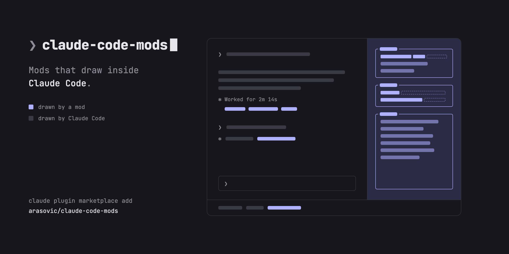
</p>

<p align="center">
  Mods for <a href="https://claude.com/claude-code">Claude Code</a> that add panes, live lines and guards to the terminal you already work in.<br>
  Install one, or all of them.
</p>

<p align="center">
  
  
</p>

<p align="center">
  <a href="#panes-beside-the-chat">Panes beside the chat</a>&emsp;
  <a href="#lines-in-the-chat">Lines in the chat</a>&emsp;
  <a href="#guards-that-work-out-of-sight">Guards</a>&emsp;
  <a href="#install">Install</a>
</p>

```sh
claude plugin marketplace add arasovic/claude-code-mods
claude plugin install session-meter@claude-code-mods
```

<br>

## Panes beside the chat

Panes dock on the right of the session. Open them with `/ctx`, `/changes`, `/timeline` and `/show-me`; from 144 columns, session-meter opens on its own and show-me opens when an answer has a diagram.

<table>
  <tr>
    <td width="55%">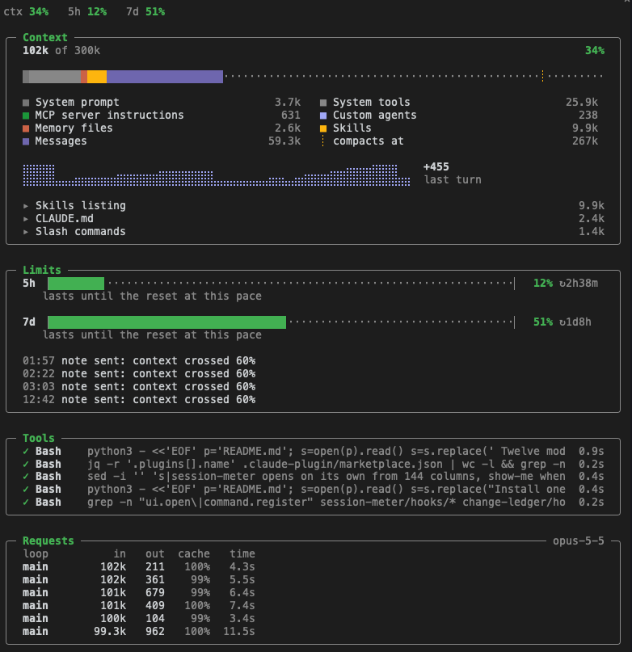</td>
    <td>
      <h3><a href="session-meter/README.md">session‑meter</a></h3>
      <p><b>See what fills your context and how fast your limits drain.</b></p>
      <p>Context by category, the 5-hour and 7-day windows with their pace, the last 30 tool calls and model requests, each request with its cache hit rate. When limits or context run high, the model gets one short note.</p>
    </td>
  </tr>
  <tr>
    <td>
      <h3><a href="change-ledger/README.md">change‑ledger</a></h3>
      <p><b>Every file this session touched, in one list.</b></p>
      <p>Lines added and removed, which agent edited each file, and how long ago. Below it, the git working tree, so edits made outside the session stand out.</p>
    </td>
    <td width="55%">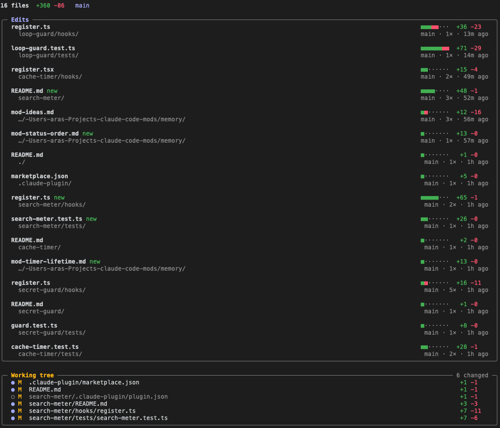</td>
  </tr>
  <tr>
    <td width="55%">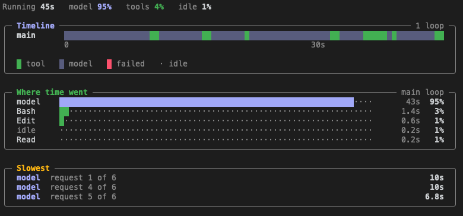</td>
    <td>
      <h3><a href="turn-timeline/README.md">turn‑timeline</a></h3>
      <p><b>Where did this turn's time go?</b></p>
      <p>The current turn as a timeline: one lane for the main loop and one per subagent, the split between model, tools and idle, and the three slowest steps.</p>
    </td>
  </tr>
</table>

### [show‑me](show-me/README.md)

**Diagrams as pictures, not as code.** Each mermaid diagram in an answer is drawn in a pane once the turn ends. `/show-me <question>` asks for an answer in diagrams.

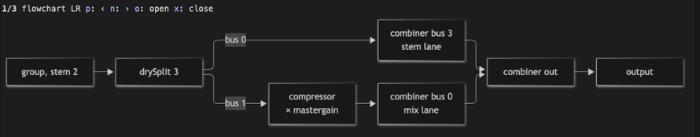

<br>

## Lines in the chat

Small lines in the places you already look: above the prompt, under it, and under each answer.

### [image‑peek](image-peek/README.md)

**See the images you paste, not just `[Image #1]`.** Thumbnails above the prompt while you write, larger pictures under the message once it is sent.

<table>
  <tr>
    <td width="50%" valign="top">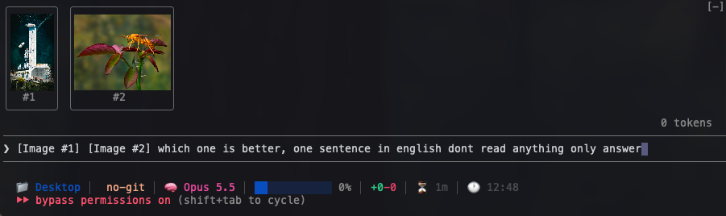<br><sub>While you write</sub></td>
    <td width="50%" valign="top">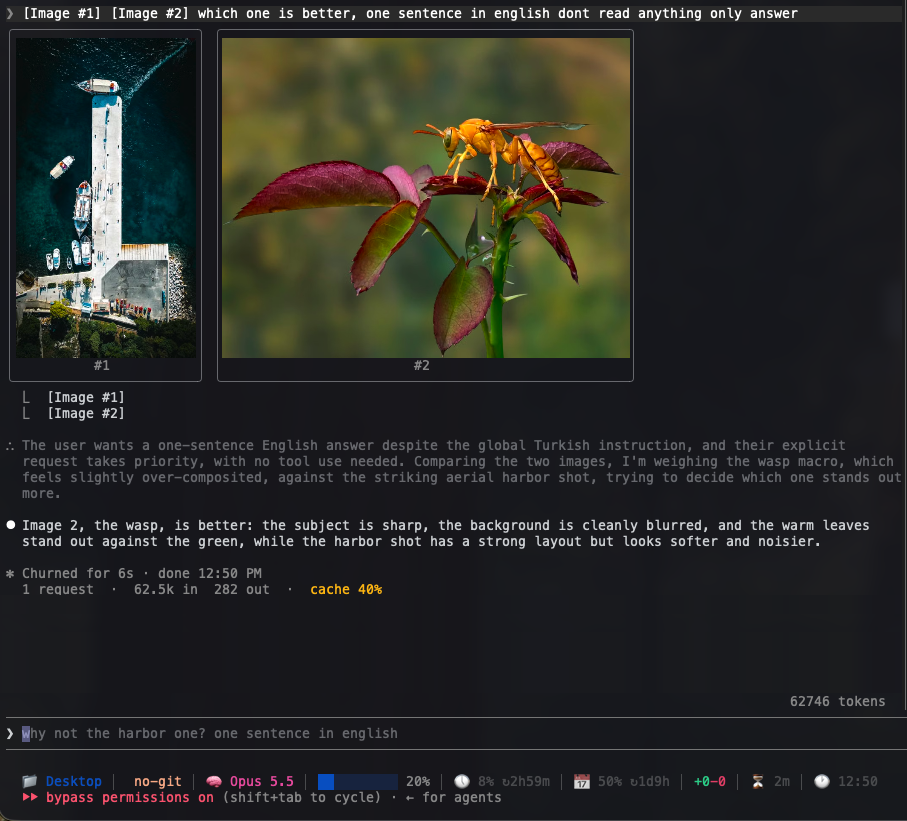<br><sub>After you send</sub></td>
  </tr>
</table>

### [pin‑board](pin-board/README.md)

**Notes Claude keeps following.** `/pin use pnpm, never npm` pins a note in one row above the prompt, or as a counter under it. Claude gets it at once, and again after `/compact` and `/clear`. Add `--keep` to keep it for the folder across restarts.

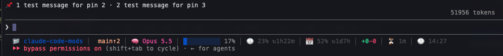

### [ci‑watch](ci-watch/README.md)

**CI results without leaving the terminal.** After Claude pushes, opens a PR or pushes a tag, each GitHub Actions run gets a progress bar above the prompt, then a green or red result. It can also flag scheduled workflows that failed while you were away.

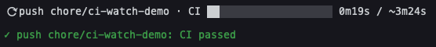

### [cache‑timer](cache-timer/README.md)

**Send your next message while the cache is still warm.** A countdown to when the prompt cache expires. Once it has, the line shows how many tokens the next message writes to the cache again.


### [turn‑footer](turn-footer/README.md)

**What each answer cost, in one line.** Tool calls, subagents, requests, tokens and cache hit rate under every answer, and the running tool with its clock in the spinner.

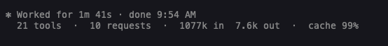

### [search‑meter](search-meter/README.md)

**How many searches went to waste.** Green found on the first try, yellow found after misses, red found nothing.


<br>

## Guards that work out of sight

These draw little or nothing. They step in when something goes wrong.

<table>
  <tr>
    <td width="50%" valign="top">
      <h3><a href="secret-guard/README.md">secret‑guard</a></h3>
      <p><b>Keys never reach the model or the transcript.</b> API keys and private keys are hidden in tool output and in your own messages. Credential files cannot be opened, and commands that print secrets do not run. A status light shows what it caught.</p>
      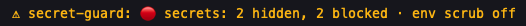
    </td>
    <td width="50%" valign="top">
      <h3><a href="loop-guard/README.md">loop‑guard</a></h3>
      <p><b>No third try of the same failing call.</b> When a call fails twice with the same error, the model is told to stop, re-read the error and change approach. A toast tells you.</p>
      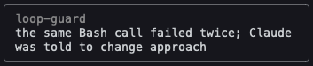
    </td>
  </tr>
  <tr>
    <td width="50%" valign="top">
      <h3><a href="guardrails/README.md">guardrails</a></h3>
      <p><b>Blocks the commands you never want run.</b> Pick rules in <code>/config</code>: Cloudflare <code>cf</code> writes, attribution lines in commits and PRs, <code>claude/</code> branch names. All start off. Claude gets the reason back and retries the right way.</p>
      <pre>guardrails: Branch names may not start with claude/;
use a purpose prefix such as fix/ or chore/.</pre>
    </td>
    <td width="50%" valign="top">
      <h3><a href="compact-keeper/README.md">compact‑keeper</a></h3>
      <p><b>Nothing is lost to <code>/compact</code>.</b> Each compaction's summary, session id, resume command and edited files are saved as one Markdown file.</p>
      <pre>~/.claude/handoffs/
  2026-10-03-0952-my-app-4f9c2a1e.md</pre>
    </td>
  </tr>
</table>

<br>

## Install

Add this repo as a plugin marketplace once, then install any mod from it:

```sh
claude plugin marketplace add arasovic/claude-code-mods
claude plugin install <mod>@claude-code-mods
```

Or install all of them (needs `jq`):

```sh
curl -s https://raw.githubusercontent.com/arasovic/claude-code-mods/main/.claude-plugin/marketplace.json \
  | jq -r '.plugins[].name' \
  | while read -r mod; do claude plugin install "$mod@claude-code-mods"; done
```

Restart Claude Code after installing. Update later with `claude plugin marketplace update claude-code-mods` and `claude plugin update <mod>@claude-code-mods`.

Tested on Claude Code 2.1.288. Mods are a recent Claude Code feature, so older versions will not load them. Pictures in show-me and image-peek need a terminal with the kitty graphics protocol, such as Ghostty or kitty. show-me also needs [`mmdc`](https://github.com/mermaid-js/mermaid-cli) on `PATH`, and ci-watch needs [`gh`](https://cli.github.com), logged in.

## Develop

Each mod's README lists its checks. `typecheck.sh` lays the plugin API's types in `.claude-plugin/types/` when they are missing or from another Claude Code build, then runs `tsc`. Run it with no argument to check every mod.

## License

MIT
